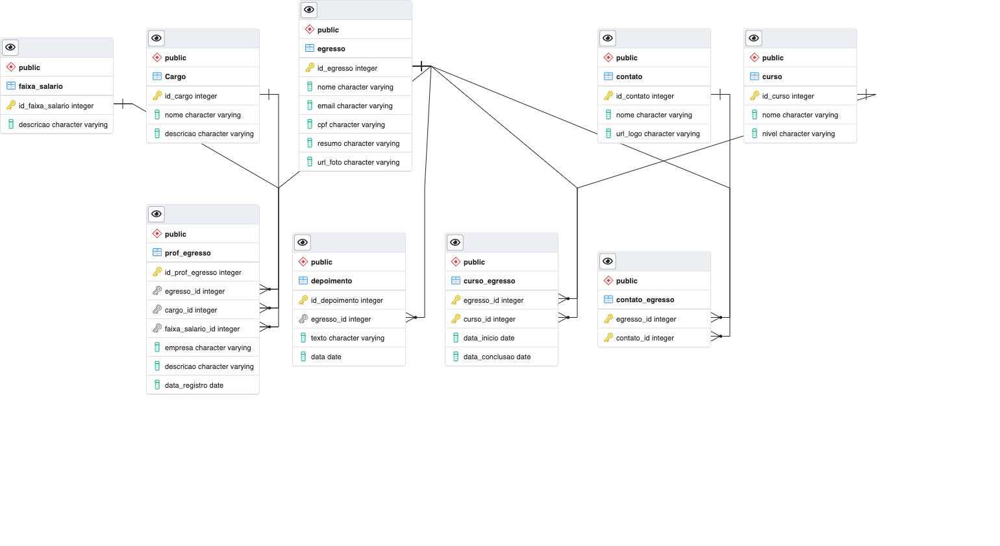

# Portal de Egresso

## Primeiros mapeamentos e testes

a) Implemente o mapeamento entidade-relacional do banco de dados da proposta do portal de egresso*.

b) Implemente os casos de teste, tomando cuidado para cobrir todas as funcionalidades**

# portal-egresso

